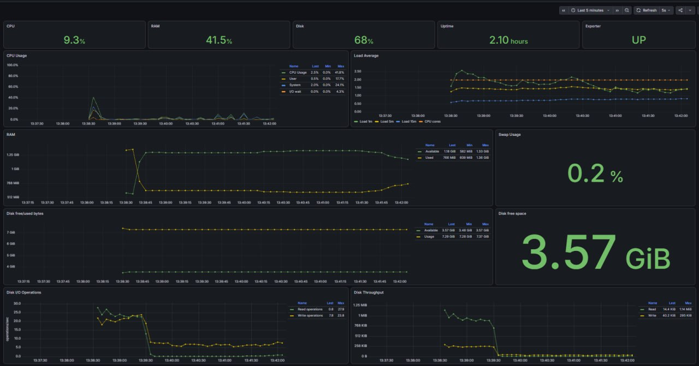

# Linux Monitoring & Observability

Portfolio showcase based on my School 21 Linux Monitoring v2.0 project.

> **Portfolio note:** this repository intentionally contains the public showcase and documentation only. The original educational solution/source code is not published here.

## What I implemented

- Configured **Prometheus** and **node_exporter** for Linux host monitoring.
- Used a `5s` scrape interval for the main Prometheus/node_exporter setup.
- Ran **Grafana** in Docker with persistent storage and restart policy.
- Built a custom Grafana dashboard for CPU, load average, RAM/Swap, filesystem, disk I/O, throughput, uptime and exporter status.
- Implemented a custom **Bash exporter** that reads Linux system data from `/proc` and `df`.
- Exposed Prometheus-compatible custom metrics through **Nginx** at `/metrics`.
- Added a dedicated Prometheus scrape job for the custom exporter with a `3s` scrape interval.
- Verified services, ports, targets, HTTP endpoints and Prometheus queries during troubleshooting.

## Architecture

```mermaid
flowchart LR
    A[Linux /proc + df] --> B[Custom Bash exporter]
    B --> C[/var/www/html/metrics]
    C --> D[Nginx /metrics]
    D --> E[Prometheus]
    F[node_exporter :9100] --> E
    E --> G[Grafana]
    H[Prometheus self metrics :9090] --> E
```

More detail: [docs/architecture.md](docs/architecture.md)

## Dashboard



The dashboard visualizes:

- CPU usage, user/system/idle/iowait;
- load average;
- RAM and Swap;
- filesystem usage and free space;
- disk read/write operations;
- disk throughput;
- uptime;
- exporter availability.

## Custom metrics

The Bash exporter publishes metrics such as:

```text
custom_cpu_usage_percent
custom_memory_available_bytes
custom_disk_free_bytes{mountpoint="/"}
custom_disk_reads_completed_total
custom_system_uptime_seconds
custom_system_load1
```

A complete list with metric types and sources is in [docs/metrics.md](docs/metrics.md).

## Prometheus scrape flow

Main node exporter:

```yaml
global:
  scrape_interval: 5s
  evaluation_interval: 5s

scrape_configs:
  - job_name: node
    static_configs:
      - targets:
          - localhost:9100
```

Custom exporter endpoint:

```yaml
- job_name: "custom_node_exporter"
  scrape_interval: 3s
  scrape_timeout: 2s
  metrics_path: /metrics
  static_configs:
    - targets:
        - "localhost:80"
```

## Grafana deployment

Grafana was launched from the official Docker image with persistent storage:

```bash
sudo docker run -d \
  --name grafana \
  --restart unless-stopped \
  --network host \
  -v grafana-storage:/var/lib/grafana \
  grafana/grafana:latest
```

Options used:

- `-d` - run the container in the background;
- `--name grafana` - assign a readable container name;
- `--restart unless-stopped` - restart the container automatically unless it was stopped manually;
- `--network host` - use the host network stack;
- `-v grafana-storage:/var/lib/grafana` - persist Grafana data in a Docker volume.

## Verification and troubleshooting

Examples of checks used in the project:

```bash
systemctl status prometheus --no-pager
curl http://localhost:9100/metrics | head
sudo ss -lntp | grep -E ':9090|:9100'
sudo promtool check config /etc/prometheus/prometheus.yml
curl http://localhost:9090/-/ready
curl http://localhost/metrics
```

Detailed explanations are in [docs/verification.md](docs/verification.md).

## Stack

`Linux` · `Bash` · `Prometheus` · `Grafana` · `PromQL` · `Nginx` · `node_exporter` · `Docker`

## What I practiced

- Linux service management with `systemd`;
- Linux system metrics and `/proc`;
- Prometheus pull-based monitoring;
- metric types (`gauge`, `counter`) and labels;
- PromQL basics;
- Grafana dashboard design;
- HTTP metric endpoints through Nginx;
- basic Docker container/volume/network operations;
- troubleshooting by checking services, ports, endpoints and targets layer by layer.
